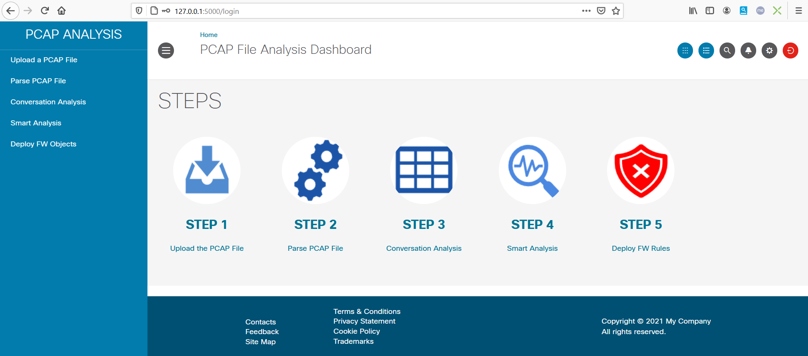

# Graphical pcap parser

This application is a Graphical PCAP file parser that leverages the infovis 2D visualization javascript library.
It leverages the CISCO-UI User Interface library as well.

This is a tiny python flask application.

The goal of such application is Network Mapping or Threat Hunting. This is a tool which helps to quickly understand who talk to who in a network.

The principle of this application is to :

1- Load a pcap file

2- Parse it and store the result into a local SQLite Database

3- Analyse the result from the Database

4- Graph conversion between IP addresses in a relation graph

The relation graph can help to visualy identify an misbehavior. And then correct the issue either by isolating the Endpoint, or block bad trafic

This application extract from the pcap file :

- timestamp
- source ip 
- source mac address
- protocol
- source port
- destination ip
- destination mac address
- destination port
- frame length

The current version of the application doesn't analyse dns requests. But it is planned for the future.

## Installation

### Create working directory

Create a working directory into you laptop.

Open a terminal window a change directory to your **working directory/flask_pcap_parser** .

### git clone the scripts

	git clone https://github.com/pcardotatgit/FMC_Add_Security_Rules.git
	cd FMC_Add_Security_Rules/

### Install a Python virtual environment

	For Linux/Mac 

	python3 -m venv venv
	source bin activate

	For Windows 
	
	We assume that you already have installed git-bash.  If so open a git-bash console and :

	python -m venv env 
	venv/Scripts/activate

	
### install needed python modules

The application uses the following modules

- flask
- sqlalchemy
- crayons
- netmiko
- sqlite3
- dpkt
- webbrowser

	
you can install them with the following  :
	
	pip install -r requirements.txt

# Run the application

From the **/flask_pcap_parser** start the application :

	python app.py

You should see in the flask the application starting. 

Your browser should automatically start and you should see a login page appearing.

Default username and password are : **admin / password**.

Use the **create_some_admins.py** script if you want to add or change usernames / passwords. Edit this script to underestand how to use it.

After successdul login you should be logged into the application home page.

And then it is quite straight forward.

Browse your laptop in order to select a pcap file to analyse. Upload it, then parse it, and then analyse it.

A red trash buttom on the top right allows you to delete all entries stored into the SQLite Database.

